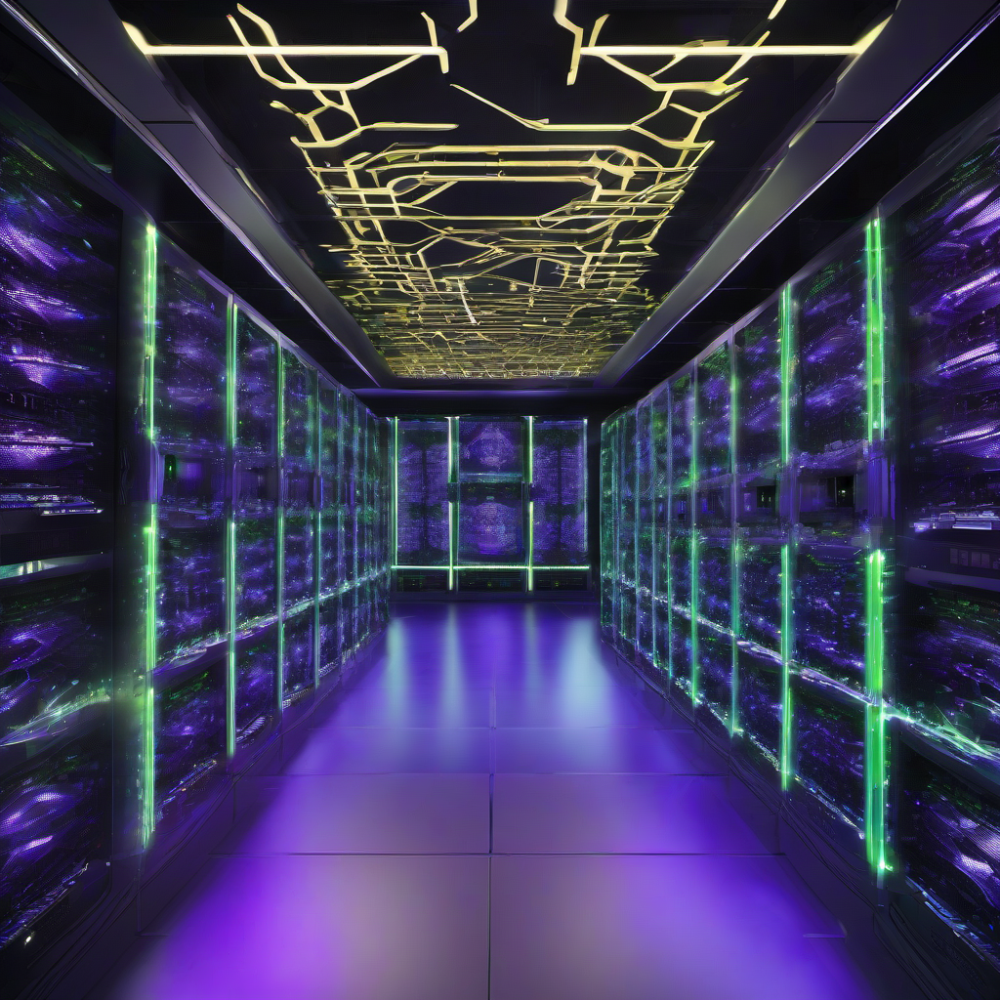

# NVIDIA's Stellar Q1 FY25: A Deep Dive into Record-Breaking Performance and Future Horizons

NVIDIA Corporation has once again showcased its formidable market position, reporting an exceptional first quarter for fiscal year 2025, ended April 28, 2024. The results underscore the company's pivotal role in the accelerated computing and AI revolution, delivering unprecedented financial growth and setting a clear trajectory for future innovation. As a large accelerated filer, NVIDIA's performance continues to captivate investors and industry watchers alike, with its common stock (NVDA) trading prominently on The Nasdaq Global Select Market.

## Financial Triumphs: A Quarter of Remarkable Growth

The first quarter saw NVIDIA achieve staggering year-over-year increases across key financial metrics:

*   **Revenue:** Soared to $26.044 billion, a monumental 262% increase from $7.192 billion in Q1 FY24.
*   **Gross Margin:** Expanded significantly to 78.4%, up 13.8 percentage points from 64.6% in the prior year, reflecting strong product mix and demand.
*   **Operating Income:** Skyrocketed to $16.909 billion, an astonishing 690% surge from $2.140 billion.
*   **Net Income:** Reached $14.881 billion, marking a 628% increase from $2.043 billion.
*   **Diluted Earnings Per Share (EPS):** Hit $5.98, up 629% from $0.82, demonstrating robust profitability.

This financial prowess is underpinned by a strong liquidity position, with cash, cash equivalents, and marketable securities totaling $31.438 billion as of April 28, 2024. Net cash provided by operating activities also saw a substantial rise to $15.345 billion, compared to $2.911 billion in Q1 FY24.

## The AI Engine: Data Center Dominance

The **Compute & Networking** segment was the undeniable powerhouse, with revenue surging 408% year-over-year to $22.675 billion. Within this, the **Data Center** revenue alone reached $22.563 billion, representing an incredible 427% increase. This growth is predominantly fueled by the NVIDIA Hopper GPU computing platform, essential for training and inferencing large language models, recommendation engines, and generative AI applications.

NVIDIA is already looking ahead, announcing its next-generation **Blackwell GPU architecture**, now in production. Customer samples are expected in Q2 FY25, with a broader ramp-up in the second half of the fiscal year. The initial demand for Blackwell is projected to be well ahead of the anticipated supply for this fiscal year, indicating continued strong demand for NVIDIA's cutting-edge AI infrastructure. Supply constraints for Blackwell offerings are expected to persist into next year.

## Diversified Performance Across Segments

While Data Center led the charge, other segments also contributed positively:

*   **Graphics:** Revenue increased 23% year-over-year to $3.369 billion, driven by an 18% rise in **Gaming** revenue.
*   **Professional Visualization:** Saw a 45% increase in revenue to $427 million.
*   **Automotive:** Revenue grew 11% to $329 million, primarily from self-driving platforms and AI Cockpit solutions.

Geographically, the **United States** saw significant revenue growth to $13.496 billion. However, revenue from **China (including Hong Kong)** was down significantly, reflecting the impact of evolving U.S. government export controls.

## Navigating Geopolitical Headwinds and Supply Chain Dynamics

The landscape of global trade continues to present complexities. U.S. government licensing requirements, particularly those impacting exports of advanced integrated circuits (like A100, H100, L40S, RTX 4090) to China and other regions, have significantly affected NVIDIA's Data Center revenue in China. While NVIDIA has developed new products specifically for China that do not require export licenses, these restrictions pose ongoing challenges and risks to the company's competitive position and future results.

To meet robust demand, NVIDIA has increased its supply and capacity purchases, adding new vendors and entering prepaid manufacturing agreements. While H100 supply is improving, H200 remains constrained. These efforts highlight the company's proactive approach to managing its complex global supply chain, though they also introduce new execution risks.

## Enhancing Shareholder Value

NVIDIA is committed to returning value to its shareholders. In Q1 FY25, the company repurchased 9.9 million shares for $8.0 billion, with an additional $14.5 billion authorized. The company also paid $98 million in cash dividends.

In a significant post-period announcement on May 22, 2024, NVIDIA revealed a **ten-for-one forward stock split**, effective June 7, 2024. This move aims to make ownership more accessible to a broader investor base. Concurrently, the quarterly cash dividend will increase by 150% from $0.04 to $0.10 per share (equivalent to $0.01 post-split), payable on June 28, 2024.

NVIDIA's Q1 FY25 results paint a picture of a company at the forefront of technological innovation, skillfully navigating market dynamics and geopolitical challenges while delivering exceptional value to its stakeholders. The focus on AI, coupled with strategic supply chain management and robust shareholder initiatives, positions NVIDIA for continued leadership in the accelerated computing era.